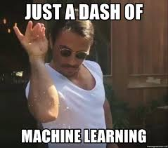
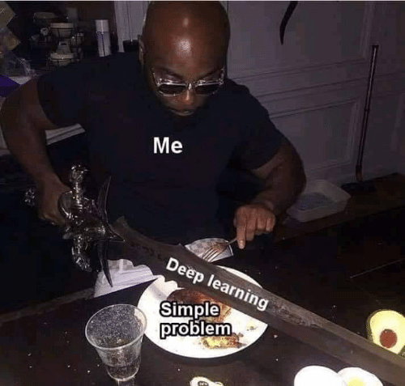
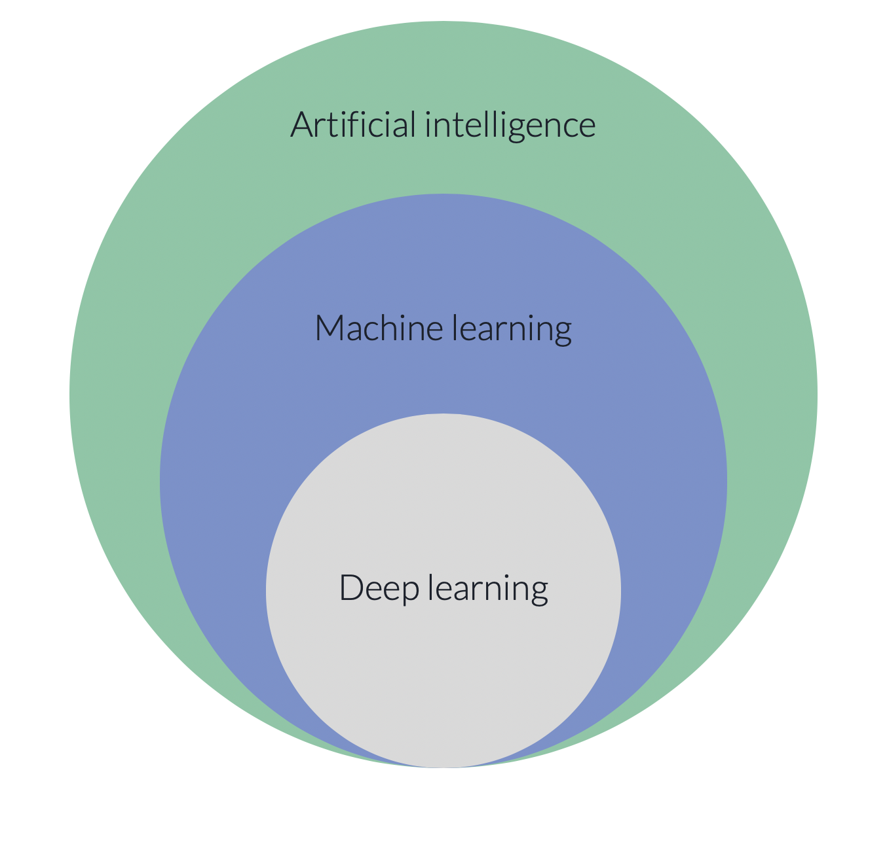

## Concepts in Machine Learning Class 1: Introduction to Machine Learning

### Objectives

Welcome to Concepts in Machine Learning from fredhutch.io! This course is designed for researchers who are interested in machine learning, and assumes no prior programming or statistics experience. There are no prerequisites for this course.

This course will introduce you to machine learning and give a broad overview of supervised and unsupervised machine learning methods. The goal of this course is to provide some conceptual background for our Machine Learning in R and Python series. Further, researchers who complete this course should have an understanding of how machine learning can be applied in biology research.

By the end of this class you should be able to:

* Define and understand the limitations of machine learning.
* Understand basic terminology like algorithm, inputs, outputs, supervised, unsupervised.
* Differentiate between unsupervised and supervised machine learning methods.

### What **isn't** machine learning?

Buzzwords like ‘machine learning’, ‘deep learning’, and ‘artificial intelligence’ get thrown around quite a bit these days. Sometimes they seemed to be used as synonyms, others as distinct entities. It can be hard to determine exactly what these big, vague terms mean to the layperson. So let’s start with what *isn’t* machine learning.

  
   
  

**Machine learning is NOT:**

* Magic
* A secret sauce
* Seasoning to be sprinkled liberally over a mundane application
* A substitute for a good understanding of your problem

### What **is** machine learning?

Recent advances in compute power, cloud technologies, data collection and data generation have thrust machine learning into the mainstream. Increasingly machine learning is looked to as a tool to solve Big Complex Problems like cancer. Often though the term machine learning is used as a sort of black box, but what actually is machine learning?

Let’s orient ourselves to the terms I mentioned in the previous slides that you may be familiar with (ML, AI, Deep learning) to get a sense of how things fit together.

* AI is a term that embodies anything that enables computers to act more like humans.
  * This is a whole field of knowledge like ‘biology’ or ‘chemistry’.
* Machine learning is a field of study within AI.
  * The focus of this field is on the extraction of patterns from large datasets.
* Deep learning is an example of a collection of similar machine learning methods.
  * It is a group of similar techniques that use neural networks to learn.
  * There are other groups of related methods such as:
    * support vector machines
    * decision trees

### Machine learning defined

Let's look at how machine learning is defined.

**Wikipedia:** Machine learning (ML) is the study of computer algorithms that improve automatically through experience. It is seen as a subset of artificial intelligence. Machine learning algorithms build a mathematical model based on sample data, known as "training data", in order to make predictions or decisions without being explicitly programmed to do so.

**Merriam Webster:** the process by which a computer is able to improve its own performance (as in analyzing image files) by continuously incorporating new data into an existing statistical model.

**[Nature Genetics Review:](https://www.nature.com/articles/nrg3920)** The field of machine learning includes the development and application of computer algorithms that improve with experience.

While these definitions vary slightly there are a few common themes to pull out:

* ML is a kind of algorithm.
  * Algorithm - A finite sequence of well-defined, computer-implementable instructions, typically to solve a class of problems or to perform a computation (Wikipedia)
   * Essentially it is a protocol for a computer
* ML incorporates data into a statistical model.
* ML improves with experience without human intervention.

### Machine learning as code

When we think of machine learning and how it applies to code we can consider machine learning to be a specific way of programming computers.

* Most programming isn’t machine learning - it’s procedural
    * Build out a set of rules that a human codes. This set of rules is called an algorithm. This ruleset remains static unless the coder intervenes and specifies more rules.
* In ML the algorithm is also designed and coded by a human. However, this kind of algorithm is able to learn from the data about specific parameters that will shape a statistical model for making predictions and inferences. The coder doesn’t necessarily know or control these parameters - the machine does.

**Machine learning is an algorithm (or set of rules) that self adjusts based on the large datasets that it is given**

### When to use machine learning

Just like any other statistical method there are specific situations where applying machine learning is appropriate. Just as important as the algorithm itself is a solid understanding of experimental design, domain expertise in the problem area youre trying to solve, and an understanding of data governance and ethics.

You cannot code the rules: 
* Tasks that cannot be solved using a simple, rule-based solution. 
* When rules depend on too many factors and many of these rules overlap or need to be tuned very finely, it soon becomes difficult for a human to accurately code the rules. You can use ML to effectively solve this problem.
* This is true for drawing conclusions about highly dimensional data

You cannot scale:
* You might be able to manually recognize a few hundred emails and decide whether they are spam or not. However, this task becomes tedious for millions of emails. ML solutions are effective at handling large-scale problems.

#### Challenge!

1. Write an algorithm/protocol/ruleset for making a PBJ sandwich
2. Write an algorithm/protocol/ruleset for determining if an email is spam

### Biology is suited for machine learning

In the past data generation had been a bottleneck in biology research but this is no longer true. Biology research is generating huge amounts of complex and increasingly integrated data!

Biology is suited for machine learning applications:
* You cannot code the rules
    * Biological systems are incredibly complex with many inputs leading to complex phenotypes. 
    * Example: if you want to determine whether or not a patient is likely to get cancer we’d need to take many datasets into account (demographic data, health/nutrition data, family history, genetic data, etc). We cannot determine and code the rules for a computer to calculate if a person is likely to get cancer or not.

* You cannot scale
    * Our human brains cannot make sense of these huge integrated datasets or even just one of them.
    * Example: a human looking at a series of bases would take years to make sense of the human genome. A computer can find patterns in our genome with relative ease.

### How is machine learning applied?

Machine learning applications are all around us! Every time Spotify serves up a customized playlist or radio station based on the music that you like, Facebook loads your newsfeed, your phone autocorrects you, or you interact with a voice assitant like Siri, you are interacting with machine learning algorithms.

Every-day applications:
* Search engines
* Recommendation systems (Yelp, Netflix, Spotify)
* Voice assistants
* Social media feeds
* Text prediction

#### Machine learning techniques are becoming increasingly important to biological research.

Researchers are developing algorithms that use machine learning to classify histopathological images, visualize and find clusters within single cell datasets, and much more.

Biology specific applications:
* Prediction of protein secondary structure based on RNA-sequence.
* Classification of histopathological images of breast tissue to identify malignant tumors.
* Using gene expression data to classify patients into different clinical groups.

Work happening here at Fred Hutch

* Gottardo lab - [automatic gating for flow cytometry data.](https://www.biorxiv.org/content/10.1101/702118v2)
* Emily Silgard's data science group - [natural language processing to extract information from unstructured electronic medical records notes.](https://www.sciencedirect.com/science/article/abs/pii/S1532046419302217)
* The Data Visualization Center - [single-cell visualization and clustering of RNA-sequencing data to find rare subtypes of cells that emerge in the mouse embryo.](https://oncoscape.v3.sttrcancer.org/atlas.gs.washington.edu.mouse.rna/landing)

### How do these machine learning applications work?

There are different types of machine learning and each have their own specific applications and requirements.

Four major paradigms in machine learning:
* **Supervised**
* **Unsupervised**
* Semi-supervised
* Reinforcement learning

The focus of this course will be on supervised and unsupervised learning, but it’s good to be aware that these are not the only types of ml.

### Anatomy of a machine learning problem
discuss inputs and outputs

dataset, features - really break down how a dataset doesn't capture the entirety of The Truth only the features we have collected. We're trying to use collected features to understand and make predictions/inference about The Truth.

### An overview of supervised learning
emphasize - labled data, concrete interpretations, 2 steps, 2 subclasses, used to make predictions

#### Example supervised learning questions

### The two steps of supervised learning: training and testing

### An overview of unsupervised learning

#### Example unsupervised learning questions

### One step to unsupervised learning: fitting

### Review!

### Next week: supervised machine learning

### Reading material
