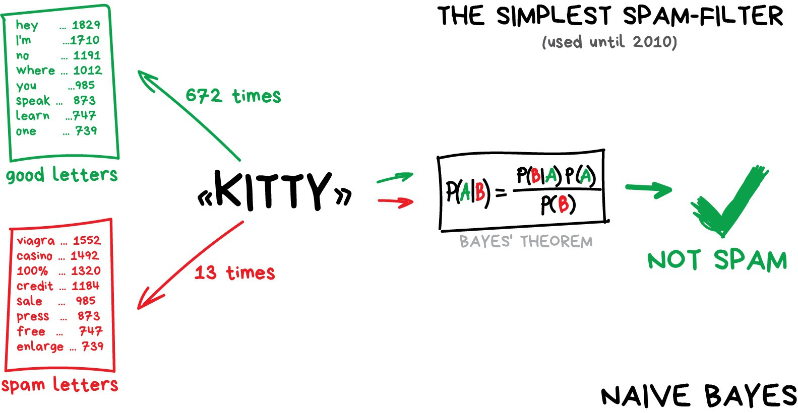
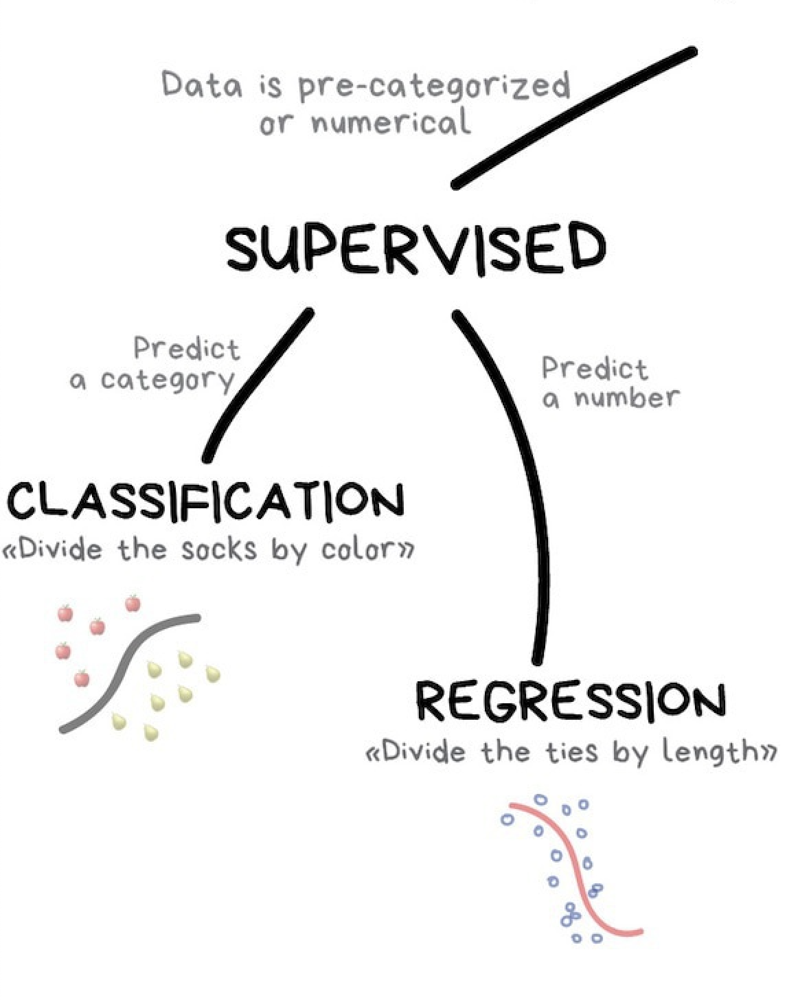
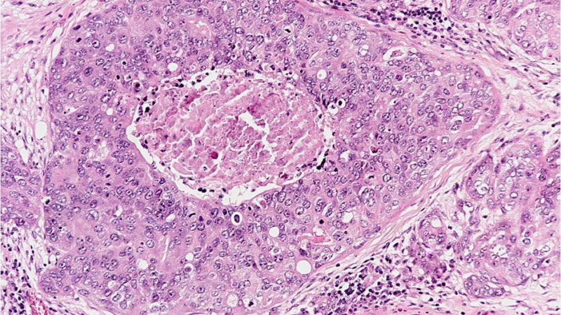
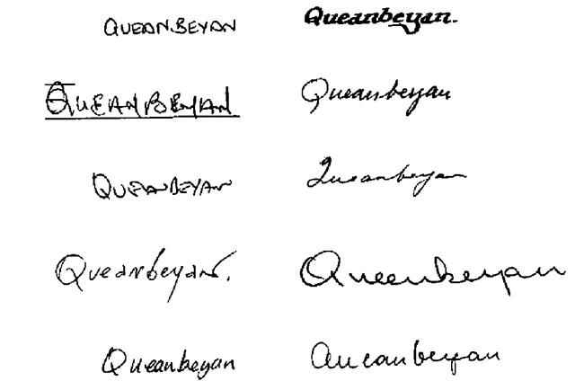
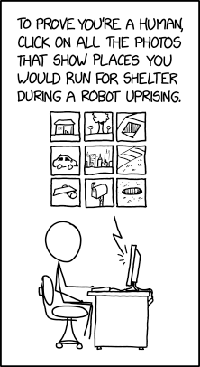
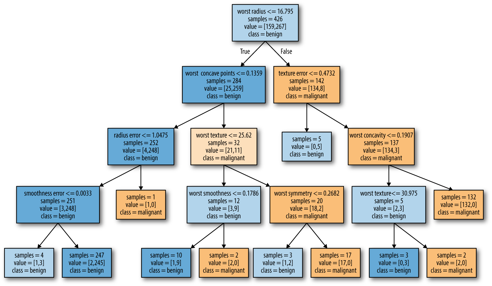
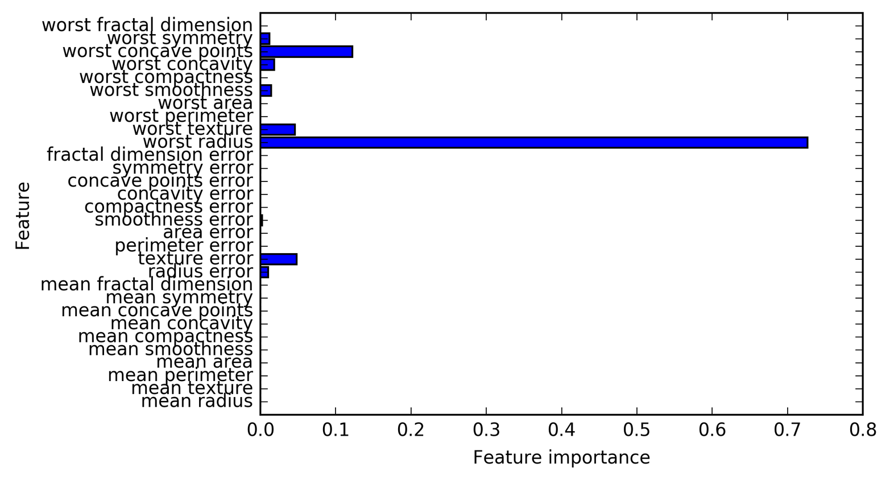
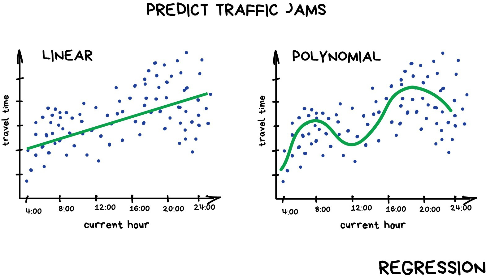
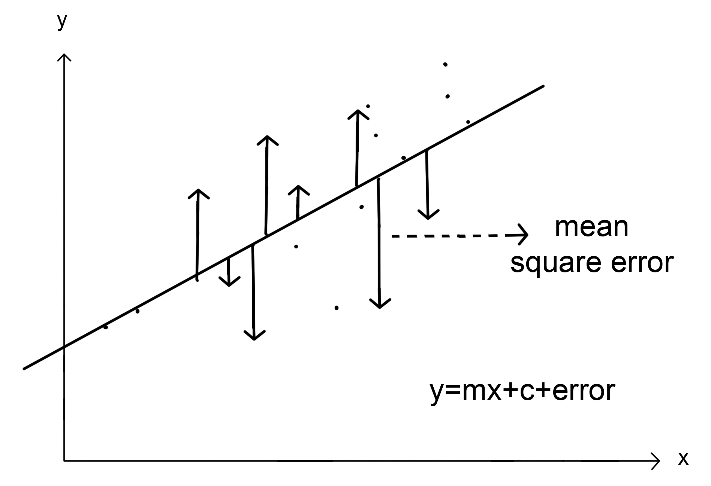

## Concepts in Machine Learning Class 2: Supervised Learning

### Objectives

Welcome to class 2 of Concepts in Machine Learning!

In the last class, we touched on all of the main concepts that we will be covering in this course including supervised and unsupervised learning, exploratory data analysis, and ethics.

By the end of this class you should be able to:

* Define and understand the limitations of supervised learning
* Differentiate between regression and classification
* Assess whether or not supervised learning is an appropriate tool for a question
* Understand basic applications of supervised learning (linear regression, logistic regression)
* Create supervised learning problem statements

### Review! What is machine learning?

Machine learning is a:
* field of study within the larger field of artificial intellegence
* way of programming computers
* an algorithm that incorporates large datasets into a statistical model and improves with experience

### Review! When to use machine learning

Machine learning is especially good at tackeling problems where **you cannot code the rules** and **you cannot scale**.

  

Some examples we've talked about are:
* Classifying emails as spam
* Recognizing hand written letters
* Predicting a patients clinical outcome
* Clustering cells by cell type based on genetic data

### Review! Anatomy of a machine learning problem

**Example: we are trying to predict whether or not someone will be diagnosed with cardiovascular disease.**

Here's an example training dataset for predicting whether or not a patient might be diagnosed with cardiovascular disease. This dataset shows paired input and output data and would be considered an annotated or labeled training dataset.

| patient_Id    | age   | htn | treat | smoking | race     | t2d | gender | numAge | bmi | tchol| sbp | cvd |
| ------------- | ----- | --- | ----- | ------- | -------- | --- | ------ | ------ | --- | ---- | --- | --- |
| HHUID00076230 | 20-40 | Y   | Y     | N       | Asian/PI | N   | M      | 29     | 23  | 189  | 170 | N   |
| HHUID00547835 | 70-90 | N   | Y     | N       | White    | Y   | M      | 72     | 35  | 178  | 118 | N   |

**Reality/truth:** a persons health history, location, occupation, diet, habits, stress levels, among many other things will play into if someone gets cardiovascular disease. 

**Dataset:** when creating the dataset that will be used to make our predictions we will never capture the whole truth. We will capture as much of the truth as we can by collecting data on various features that we believe are related to the problem we are trying to solve. Many underlying factors that lead to the cardiovascular disease may be unknown or we might not be able to measure them or capture them in our dataset.

**Features/variables:** These are the measurable data that make up our dataset. Some features collected might be useless while others might carry a substantial amount of weight in making the prediction. Since this is a training set one of the variables included is the label that we are trying to predict (`cvd`).

**Inputs:** Features that we have collected and will use to make our prediction. In this dataset our inputs would be all of the columns except `patient_Id` and `cvd`. We would likely remove `pateint_Id` because a random identifier won't have any predictive power and `cvd` would not be included as an input since it is the target we are trying to predict.

**Output:** The variable that we are trying to predict. In this case `cvd`.

### An overview of supervised learning

  

The goal of supervised machine learning is to fit a model that relates response variables to predictors and can accurately predict the response for future observations of predictor variables. We will cover supervised learning more in depth in class 2 of this series.

Supervised learning is one of the most commonly used forms of machine learning and it's generally easier to implement and interpret than unsupervised learning alogrithms. 

A hallmark of supervised learning algorithms is that they work in two steps: training and testing. This requires training the algorithm on example datasets with inputs that are annotated (or labled) with the correct response. Once training is complete the algorithm will be tested on a seperate labled dataset and it's performance is evaluated.

Ideally an the algorithm will be specific enough to accurately predict the response variable, but generalizable so that it works with new datasets.

There are two subclasses of supervised learning:
1. Regression: predicting a numeric
2. Classification: predicting a category

### Some basic examples of supervised machine learning

#### Determining if a tumor is benign or not from an image

  

* Input: Images of tumors
* Output: Binary; begign or malignant
* Dataset: Need a database of medical images, expert diagnosis of benign or malignant

#### Identifying handwritten letters

  

* Input: Scanned, handwritten letters
* Output: The actual character
* Dataset: Need thousands of handwritten letters and to annotate the correct letter for each one

### How do you train and test a machine?

Training is the hallmark of a supervised learning algorithm because this is the step where a 'supervisor' essentially gives the machine the answers. A machine is trained by feeding it large labeled datasets (aka training or validation sets) like we just learned about above. The algorithm works by finding patterns in the dataset and building it's own set of rules to determine what the outcome might be based on new inputs. When we say large we mean that these training sets should have at a minimum tens of thousands of rows. The more data the better.

Going back to our example of identifying spam emails, a user would provide an algorithm tens of thousands of emails along with whether or not that email is spam or not. If training is effective when given a new email the algorithm should be able to accurately predict whether or not it is spam.

Testing occurs after you have trained your model. A testing dataset will be similar to the training dataset in that it will have the same features that the algorithm uses to make it's prediction. The training data must be kept seperate from the data that the algorithm was trained on.

### Training a machine starts with data collection

All supervised learning algorithms require large training and testing datasets. 

Creating labeled datasets is one of the most time intensive pieces of supervised machine learning. Sometimes this can be done automatically by merging datasets or scraping the internet, but many times the labeling must be done manually. Automatic labelling is quicker and cheaper, but generally messier and less accurate so lots of quality controle and cleaning are required. Manual data collection is expensive and time consuming, but with fewer errors. It's not uncommon for companies to use their own customers for free labeling. You likely have been involved in some form of labeling yourself! 

  

We will take a more in depth look at what makes a good dataset in class 4 when we discuss exploratory data analysis and ethics.

Data collection and labeling is an intensive process and it can be incredibly difficult to create a comprehensive, 'good', dataset. In fact, while some companies might release the source code for their machine learning algorithms, the underlying data that they use is generally kept private because it is so valuable.

### Generalization, overfitting, and underfitting

The goal in supervised learning is to build a model that can make accurate prediction on new, unseen datasets that have the same features of the test set used. A model that is capable of making accurate predictions on new data is called *genderalizable*. We want to create a model that can generalize as accurately as possible. 

If training and testing sets are similar enough, we would expect the model to be accurate on the training set. This might sound like a good thing, however, it can cause problems. We can always build a more and more complex model until we are almost 100 percent accurate on the training set, but the only way to truely test how well a model works on new data is by evaluation on a test set. Simple models will generalize better to new data.

*Overfitting* occurs when a model is fitted too closely to the specific artifacts of a dataset. In this situation the model will work very well with training data but fail to generalize to new data.

*Underfitting* occurs when a model is too simple to capture variability in the dataset. In this situation the model won't work well on the training set.
* Example: "Everyone who smokes will get cancer" does not capture any of the variablity in possible outcomes.

### Bias-variance trade off

  

As a model gets more complex, it will become better at predicting on training data. However, if it becomes too complex then it will begin to fail to generalize to new data. This relationship is called the *bias-variance trade off*.

* Bias is the amount of error introduced by approximating real-world phenomena with a simplified model.
* Variance is how much your model's test error changes based on variation in the training data. It reflects the model's sensitivity to the quirks of the dataset it was trained on.

The ideal situation is one where performance is both highly accurate and generalizable to new data. As you can see in the image above on the training set increasing model complexity will result in a more accurate result. However, on the testing set increasing model complexity only works to improve accuracy to an extent after which it become detrimental.

#### The relationship between model complexity and dataset size

Model complexity is closely tied to the variation of inputs contained in the testing set. Variation can only be comprehensively captured by having very large datasets. You can avoid overfitting by increasing the size of the datasets and therefore increasing the variety of data points in your dataset.

**An important note is that adding data points that are duplicates or very similar to those already captured in the dataset will not increase complexity**

### Two kinds of supervised learning: classification and regression

The main difference between classification and regression is that classification predicts a categorical variable and regression predicts a continuous numerical value.

  

### Classification

Classification aims to predict a class label, which is a choice from a predetermined list of possibilities.
* Binary classification: Classifying into exactly two classes.
* Multiclass classification: Classifying into more than two classes.

*Decision trees* and *support vector machines* are two kinds of classification methods.

### Decision trees are a common form of classification

Decision trees are widely used for both classification and regression tasks. The machine essentially learns a series of if/else questions that will lead to a decision. 

Creating a decision tree means the machine is creating the series of if/else questions that will most efficiently lead to the decision. Each of these if/else questions is called a 'test'. The machine learning algorithm iterates over all possible test sequences to find the tree that is most informative and accurate in predicting our target output variable.

You can see how it would be fairly easy to overfit a decision tree. We can keep adding more and more decisions until our training set is perfectly sorted. Two ways to mitigate this with decision trees are:
1. Pruning: Removing or collapsing nodes that contain very little information at the bottom of the tree.
2. Pre-pruning: Stopping the creation of the tree early by limiting the maximum depth of the tree or requiring a minimum number of data points in a node to keep splitting it.

  

Above is a decision tree built on a breast cancer dataset to predict whether or not a tumor is malignant or benign. This is a relatively small tree with a depth of four and it's already a bit overwhelming to make sense of. Trees with a depth of ten are not uncommon and can be even more difficult to grasp.

It can be helpful to orient yourself by finding out which paths of the tree most data points take. You can assess this on the image above by looking at the `samples` variable shown in each node.

### Feature importance to summarize useful properties in a tree

Feature importance is a commonly used method to summarize the inner workings of a decision tree. It captures how important each feature is for the decision the tree makes. It is always a number between 0 and 1, where 0 means a feature wasn't used at all and 1 means the feature perfectly predicts the target outcome. The feature importance of each feature should always add up to 1.

  

The above image summarizes the feature importance for each feature in the tree above.

### Testing a classification algorithm

A confusion matrix (also known as an error matrix) is a way to test the accuracy of your model. A confusion matrix summerizes the results of the classification algorithm by highlighting false positives, false negatives, true positives, and true negatives.

Below is an example of a confusion matrix for a binary classifier.

  

In this very basic example there are two possible predicted classes: "yes" and "no". We could imagine this classifier might be predicting the presence of a disease where "yes" means that a patient has the disease.

What can we learn from this matrix?
* This classifier made a total of 165 predictions (e.g., 165 patients were being tested for the presence of that disease).
* Out of those 165 cases, the classifier predicted "yes" 110 times, and "no" 55 times.
* In reality, 105 patients in the sample have the disease, and 60 patients do not.

Confusion matrix terminology:
* true positives (TP): These are cases in which we predicted yes (they have the disease), and they do have the disease.
* true negatives (TN): We predicted no, and they don't have the disease.
* false positives (FP): We predicted yes, but they don't actually have the disease. (Also known as a "Type I error.")
* false negatives (FN): We predicted no, but they actually do have the disease. (Also known as a "Type II error.")

There are many different metrics that can be derived from a confusion matrix. Two of the most basic metrics are *accuracy* and the *error rate* of a classifier.
* Accuracy: A measure of how often the machine guesses correctly
  * `(TP+TN)/total = (100+50)/165 = 0.91`
* Error rate: A measure of how often the machine guesses incorrectly
  * `(FP+FN)/total = (10+5)/165 = 0.09`
  * Equivalent to `1 - Accuracy`

You could further interrogate the above problem by evaluating the sensitivity of the algorithm. Sensitivity measures the true positive rate and would show that the algorithm has 100% sensitivity for cat pictures and 0% sensitivity for dog pictures.

### Regression

  

Regression is a form of supervised learning that predicts a continuous numerical value. 
* Linear regression: Aims to draw a straight best fit line through a field of data points. 
* Polynomial regression: Aims to draw a curved best fit line through a field of data points.

### Linear regression (AKA ordinary least squares)

  

This is the most simple form of regression. The linear regression aims to fit a straight line onto the data that minimizes the mean squared error between the predicted value and the true output value. The mean squared error is the sum of the squared differences between the predictions and the true values, divided by the number of samples.

You can also use polynomials to model curvature and interaction effects.

Ordinary least squares regressions are very sensitive to outliars!

### Testing a regression algorithm

Similarly to classification algorithms, there are many different metrics that can be used when testing and tuning a regression algorithm.

Some common choices include:
* Mean Squared Error (MSE)
* Root Mean Squared Error (RMSE)
* Mean Absolute Error (MAE)
* R Squared (R²)
* Adjusted R Squared (R²)
* Mean Square Percentage Error (MSPE)
* Mean Absolute Percentage Error (MAPE)
* Root Mean Squared Logarithmic Error (RMSLE)

Which metric you will use will be highly dependent on the context in which you're evaluating your algorithm.

#### R Squared (R^2) is one of the simplest evaluations of a regression

R squared is a very basic indicator of 'goodness of fit'. It measures how well the regressions predictions approximate the real data points. An R squared of 1 indicates a perfect fit and an R squared of 0 indicates no correlation whatsoever.

#### Mean squared error (MSE) is another common evaluator

Here the average squared value of the difference between estimated values and actual values. It measures the quality of the estimator. MSE is always a non-zero number and the closer to zero it is the better the fit.

### Practice with problem statements

## Wrap up

Today, we covered some of the main topics of supervised learning. We discussed the importance of data collection, dove into classification methods like decision trees and different kinds of regression methods, and practiced writing supervised learning problem statements. For more in depth information check out the optional materials below. Specifically the Visual intro to Machine Learning has a great visualization of how decision trees work.

Next class we will review concepts from the first two classes and cover unsupervised machine learning methods for clustering and dimensionality reduction.

### Reading materials

[Yee, S., &amp; Chu, T. (2015). A visual introduction to machine learning. Retrieved June 22, 2020, from http://www.r2d3.us/visual-intro-to-machine-learning-part-1/](http://www.r2d3.us/visual-intro-to-machine-learning-part-1/)
* An animated, scrolling walkthrough of a decision tree.

[Schrider, D. R., & Kern, A. D. (2018). Supervised machine learning for population genetics: a new paradigm. Trends in Genetics, 34(4), 301-312.](https://pubmed.ncbi.nlm.nih.gov/29331490/)
* A review of supervised machine learning in population genetics
