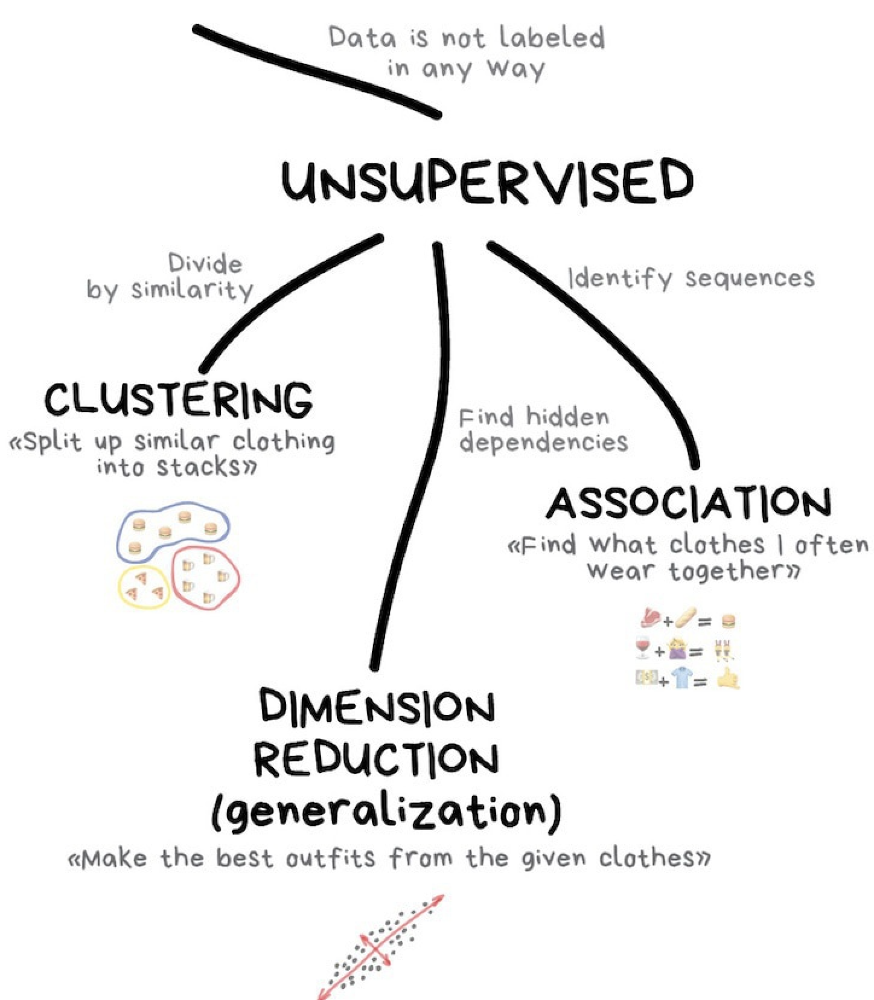
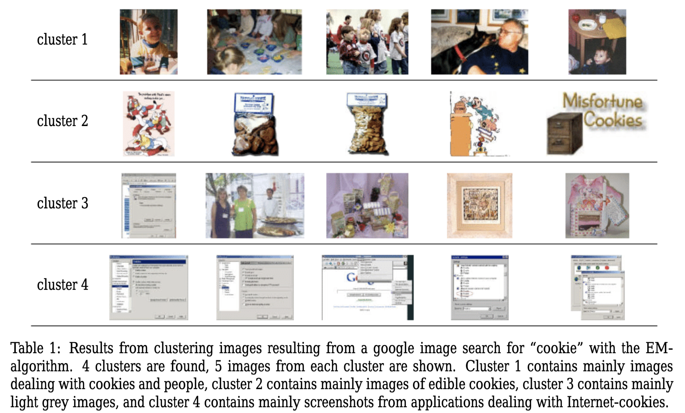
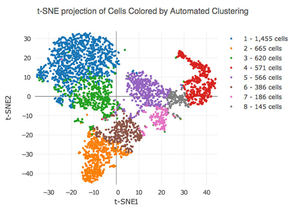
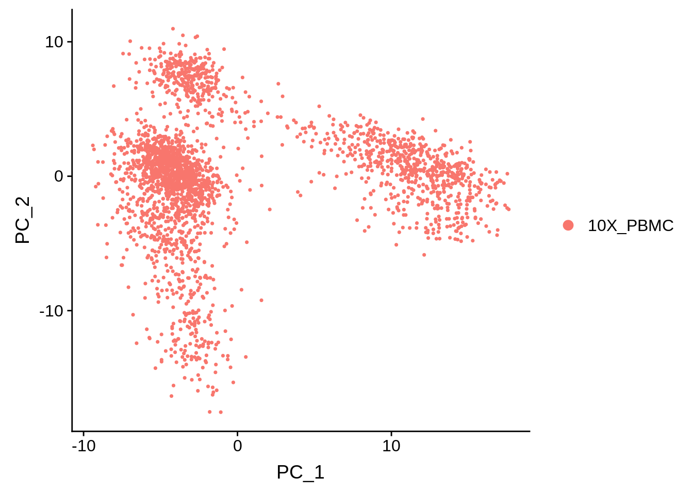
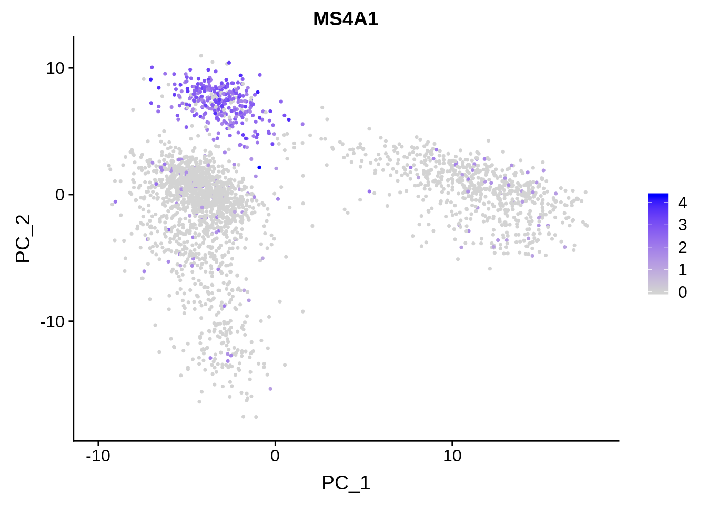
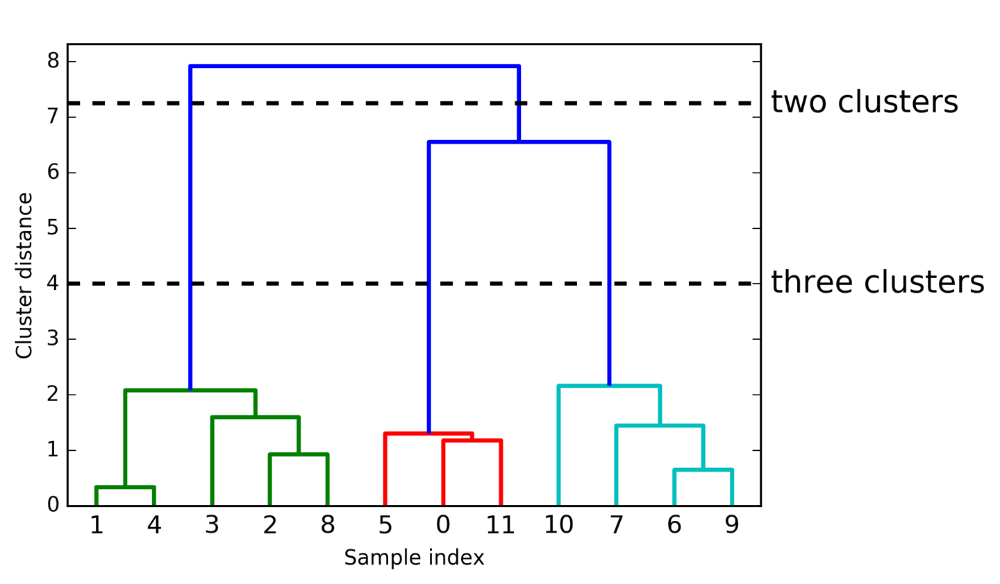
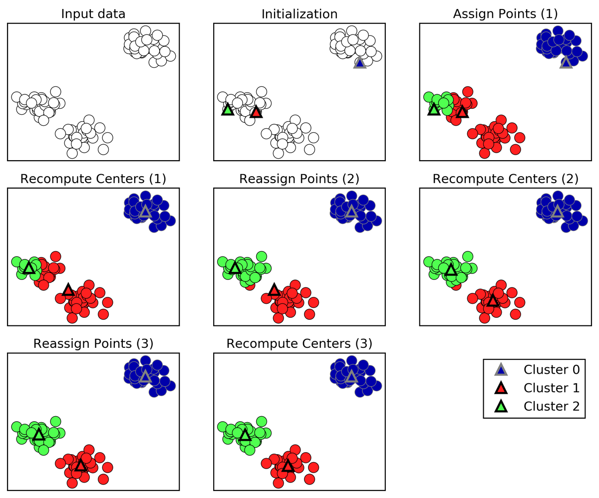
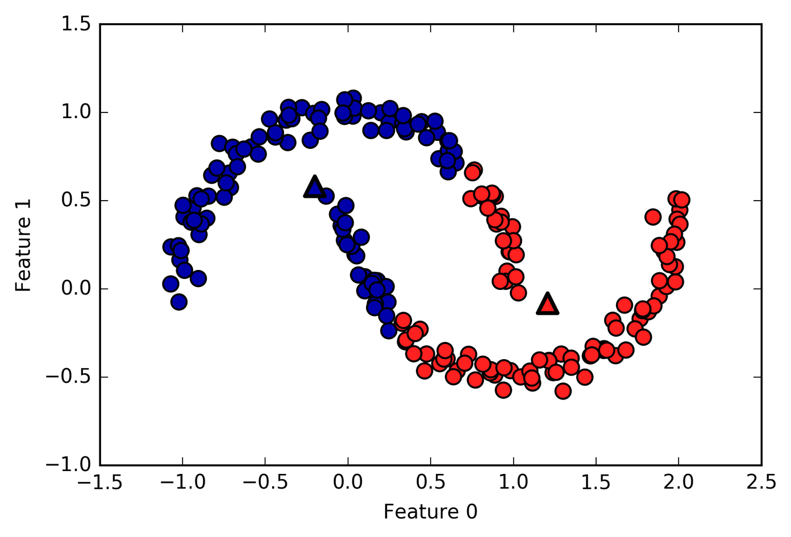
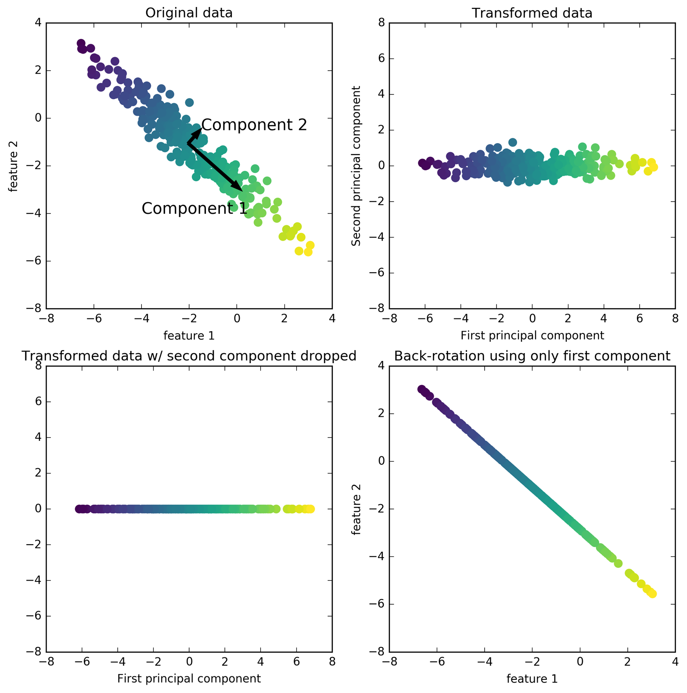

## Concepts in Machine Learning Class 3: Unsupervised Learning

### Objectives

Welcome to class 2 of Concepts in Machine Learning!

In the last class we dug a little deeper into supervised machine learning concepts and methods. Today we will do essentially the same thing but cover unsupervised learning!

By the end of this class you should be able to:

* Define unsupervised learning
* Differentiate between dimensionality reduction and clustering
* Assess whether or not unsupervised learning is an appropriate tool for a question
* Understand basic applications of unsupervised learning (PCA, Kmeans)
* Create unsupervised learning problem statements

### Review of last class

Machine learning is a:
* field of study within the larger field of artificial intellegence
* an algorithm that incorporates large datasets into a statistical model and improves with experience

**Example: we are trying to cluster patients to find if there are novel subgroupings within the dataset**

Here we are looking at the exact same example dataset as the first class. You'll notice that our intended outcome is slightly different than when we were using the dataset for supervised learning. Instead of predicting whether or not a patient is likely to be diagnosed with cardiovascular disease we want to explore the data for underlying patterns.

| patient_Id    | age   | htn | treat | smoking | race     | t2d | gender | numAge | bmi | tchol| sbp | cvd |
| ------------- | ----- | --- | ----- | ------- | -------- | --- | ------ | ------ | --- | ---- | --- | --- |
| HHUID00076230 | 20-40 | Y   | Y     | N       | Asian/PI | N   | M      | 29     | 23  | 189  | 170 | N   |
| HHUID00547835 | 70-90 | N   | Y     | N       | White    | Y   | M      | 72     | 35  | 178  | 118 | N   |

**Reality/truth:** The factors that lead to someone being diagnosed with cardiovascular disease are complex and difficult to detangle. Because of this, there might be subgroups of patients with similar features that might be interesting to study. For example, we might find a cluster of patients who are young, don't smoke, and have relatively healthy cholestorol and blood pressure that are all diagnosed with cardiovascular disease. 

**Dataset:** When creating the dataset that will be used to make our predictions we will never capture the whole truth. We will capture as much of the truth as we can by collecting data on various features that we believe are related to the problem we are trying to solve. Many underlying factors that lead to the cardiovascular disease may be unknown or we might not be able to measure them or capture them in our dataset. Think of the hypothetical cluster of young, relatively healthy, non-smokers from above. Perhaps there is a variable that we are missing that would illuminate us as to why these patients were diagnosed with cardiovascular disease?

**Features/variables:** These are the measurable data that make up our dataset. Some features collected might be useless while others might carry a substantial amount of weight in making the prediction. Since this is a training set one of the variables included is the label that we are trying to predict (`cvd`).

**Inputs:** Features that we have collected and will use to cluster our datapoints. In this dataset our inputs would be all of the columns except `patient_Id` since it is the feature that we will be clustering on.

**Output:** Unlike in our supervised learning example `cvd` is no longer considered an output because unsupervised learning algorithms do not aim to predict a specific target variable. The output for an unsupervised learning algorithm is generally a visualization of clusters or a new representation of datapoints.

#### New term!

**Object:** An object is the variable we are trying to cluster on. This is the variable that each data point will represent. In our example of clustering patients, each data point in our cluster would represent a unique patient identifier.

### What is unsupervised machine learning?

  

The goal of unsupervised learning is to detect the underlying structure and patterns in a dataset with no pre-existing labels. The lack of pre-existing labels means that the algorithm is able to work with minimal human supervision which is why we call these methods 'unsupervised'.

Unlike with supervised learning, unsupervised learning methods do not require annotated training data to work. With no training or testing required there is only one step, fitting.

There are two kinds of supervised learning that we will talk about today:
1. Unsupervised transformations: Create a new representation of a complex dataset that is easier to understand than the original.
2. Clustering: Partition data into distinct groups of similar objects.

### Some basic examples of unsupervised machine learning

#### Clustering similar images

  

* Input: Images from a google search for the term "Cookies"
* Output: Similar images sorted into groups

#### Grouping handwritten letters

  

* Input: Scanned, handwritten letters
* Output: Groups of similar characters
* Dataset: Need thousands of handwritten letters

#### Challenge!

You might have noticed that the second exammple is *almost* identical to last classes.

> #### Identifying handwritten letters
>
> * Input: Scanned, handwritten letters
> * Output: The actual character
> * Dataset: Need thousands of handwritten letters and to annotate the correct letter for each one

1. What is the difference between supervised classification and unsupervised clustering of handwritten letters? How might the output look different?

### Challenges of unsupervised machine learning

The main challenge of unsupervised learning is that it can be difficult to tell if the algorithm learned something useful. Since there is no labeled information to train on we cannot tell the algorithm what we're trying to predict and we have no clue about what the right output should look like. Because of this, it can be hard to tell if an algorithm "did well". Unsupervised learning algorithm outputs must be inspected manually to gain any information.

  

Consider the above output from a dimensionality reduction method called t-Distributed Stochastic Neighbor Embedding (t-SNE). Here we are automatically clustering cells based on their RNA-sequencing results. You'll notice that while each cluster is uniquely colored we are given no information about why they are clustered this way other than the machine picked up some underlying pattern in their RNA-sequencing results. It is up to the investigator to further interrogate these clusters to figure out if there is a meaningful difference between these clusters.

One way to derive meaning from these clusters is to apply labels after the fact and see if there are any patterns in the visualization. Lets take a look at an example of this below.

  
   

Here we have a PCA of single-cell RNA-sequencing samples from the analysis package [Seurat](https://satijalab.org/seurat/). On the left, all the data points are labled as `10X_PBMC`. This denotes that all of these cells are peripheral blood mononuclear cells sequenced with 10X Genomics sequencer. On the right we have the exact same PCA plot, but the points are labeled based on how highly they are expressing the gene `MS4A1`. This might be a gene of high importance to the researcher and the fact that there is a cluster of cells expressing this gene highly might have some significance. Again, further investigation is required to make any quantitative statements about this.

### When to use unsupervised learning

Due to the challenges we discussed above, unsupervised learning is generally used in an exploratory step of analysis. 

Common applications of unsupervised learning:
* When you want to learn more about the underlying structures in the data.
* As a preprocessing step for supervised learning algorithms.
  * Learning a new representation of the data can highlight outliars, improve accuracy downstream, and reduce the memory/time required for further analysis. 

### What is clustering?

* Clustering is the organization of unlabled data into groups (clusters) based on how similar they are. 
* Clustering is a task that can be accomplished by various algorithms that differ in how they understand what constitutes a cluster and how they find clusters.
* *centroid based clustering* and *hierarchical clustering* are two different types of clustering.

### Connectivity-based clustering (heirarchical)

The hallmark of heirarchical clustering is that these algorithms do not provide a single partitioning of the dataset. Instead, they provide a heirarchy of clusters that merge with eachother at certain distances. Often heirarchical clustering is visualized via a dendogram like the one below.

  

These algorithms connect "objects" to form "clusters" based on their [distance](https://en.wikipedia.org/wiki/Statistical_distance#:~:text=In%20statistics%2C%20probability%20theory%2C%20and,or%20a%20wider%20sample%20of). The y-axis marks the distance at which the clusters merge, while the objects are placed along the x-axis such that the clusters don't mix.

#### Making sense of dendograms

* The dendrogram shows data points as points on the bottom (numbered from 0 to 11). 
* A tree is plotted with these points (representing single-point clusters) as the leaves, and a new node parent is added for each two clusters that are joined.
* Reading from bottom to top, the data points 1 and 4 are joined first. Next, points 6 and 9 are joined into a cluster, and so on.
  * Points that are joined first are the most closely related.

### Centroid-based clustering

These algorithms work by finding the specified number of centroids within the dataset. A centroid is the geometric center of a shape. These algorithms generally require that the analyst tell the machine how many clusters to look for.

### K-means clustering

K-means clustering is one of the most simple and commonly used clustering algorithms. It works by finding "cluster centers" that represent certain regions of the data. The algorithm knows how many clusters to look for because the analyist will specify it as a paremeter. 

#### A walkthrough of K-means clustering

  

* Cluster centers are shown as triangles
* Data points are shown as circles
* Colors indicate cluster membership. 
  * The analyst specified three clusters, so the algorithm was initialized by declaring three data points randomly as cluster centers (see “Initialization”).
* Then the iterative algorithm starts.
  * First, each data point is assigned to the cluster center it is closest to (see “Assign Points (1)”).
  * Next, the cluster centers are updated to be the mean of the assigned points (see “Recompute Centers (1)”).
  * Then the process is repeated two more times. 
  * After the third iteration, the assignment of points to cluster centers remained unchanged, so the algorithm stops.

#### Challenges with K-means clustering

K-means clusters are defined solely by its center. This means that each cluster is a convex, or circular, shape. As a result, k-means is limited to capturing relatively simple shapes. It's also worth noting that k-means assumes that all clusters have the same "diameter" and always draws the boundary between clusters to be exactly in the middle between the cluster centers.

  

Above is an example case where k-means fails to capture two obvious clusters.

### Unsupervised transformations

Algorithms that do unsupervised transformations of a dataset create a new representation of the data that is easier for humans or other algorithms to understand compared to the original representation. A very common application of this is dimensionality reduction. This is when a high-dimensional representation of the data, consisting of many features, is represented in a way that summerizes the essential characteristics with fewer features. Dimensionality reduction is commonly used to reduce a highly dimensional dataset to two dimensions for visualization purposes.

Unsupervised transformations can also be used to find parts or components that make up the data. An example of this is topic extraction on a collection of text documents. The task here is to find out which topics are discussed in each document. This can be used to track discussion of themes like elections or pop-stars on social media.

### Dimensionality reduction

As mentioned previously, dimensionality reduction's most common motivation is visualization, compressing the data, and finding a representation that is more informative for further processing. 

One of the simplest and most widely used algorithms for all of these is principal component analysis. Other methods are non-negative matrix factorization (NMF), which is commonly used for feature extraction, and t-SNE, which is commonly used for visualization using two-dimensional scatter plots.

### Principle componant analysis (PCA)

Principal component analysis is a method that rotates the dataset in a way such that the rotated features are statistically uncorrelated. This rotation is often followed by selecting only a subset of the new features, according to how important they are for explaining the data.

#### PCA is most often used to visualize high-dimensional datasets. 

It's very easy to visualize and make sense of 2-dimensional data. You might plot weight against height or miles per gallon against car price to gain some insight on how those two variables correlate. This becomes tricky when datasets have more than two variables. You might be able to visualize dataset with less than ten variables using a [pair plot]() to gain some insight. Pair plots work by giving us a partial picture of the data by showing us all the possible combinations of two features. This kind of visualization doesn't scale. Imagine a relatively small dataset with 30 features. A pair plot of this dataset would result in 435 different scatter plots. We'd never be able to look at this plot in detail and make sense of it.

#### A walkthrough of PCA

  

**The first plot (top left) shows the original data points, colored to distinguish among them.**
* First, the algorithm finds the direction of maximum variance, labeled "Component 1".
  * This is the direction (or vector) in the data that contains the most information.
* Then the algorithm finds the direction that contains the most information while being at a right angle to the first direction.
  * In 2-dimensional space there is only one possible orientation of a right angle.
  * In highly dimensional space there would be an infinite number of possible right angles.
* The directions found during this process are called principal components. They are the main directions of variance in the data.
* Generally, there are as many principal components as original features in the dataset.

**The second plot (top right) shows the same data, but now rotated so that the first principal component aligns with the x-axis and the second principal component aligns with the y-axis.**
This is a PCA plot of the first and second principal components.

**The third plot (bottom left) shows how we might use PCA by retaining only some of the principal components.**
This plot reduces the data from a two-dimensional dataset to a one-dimensional dataset. Note, that instead of keeping only one of the original features, we found the most interesting direction (top left to bottom right in the first panel) and kept this direction, the first principal component.

**In the last panel (bottom right) we undo the rotation and add the mean back to the data**
These points are in the original feature space, but we kept only the information contained in the first principal component. This transformation is sometimes used to remove noise effects from the data or visualize what part of the information is retained using the principal components.

## Wrapping up

Today, we dug deeper into what unsupervised machine learning is and when it can be applied. We touched on both heirarchical and centroid-based clustering and principal component analysis for dimensionality reduction.

Next class, is focused on exploratory data analysis and ethics in machine learning. These are crucial steps to setting up a successful machine learning application.

## Extra Materials

https://idyll.pub/post/dimensionality-reduction-293e465c2a3443e8941b016d/
