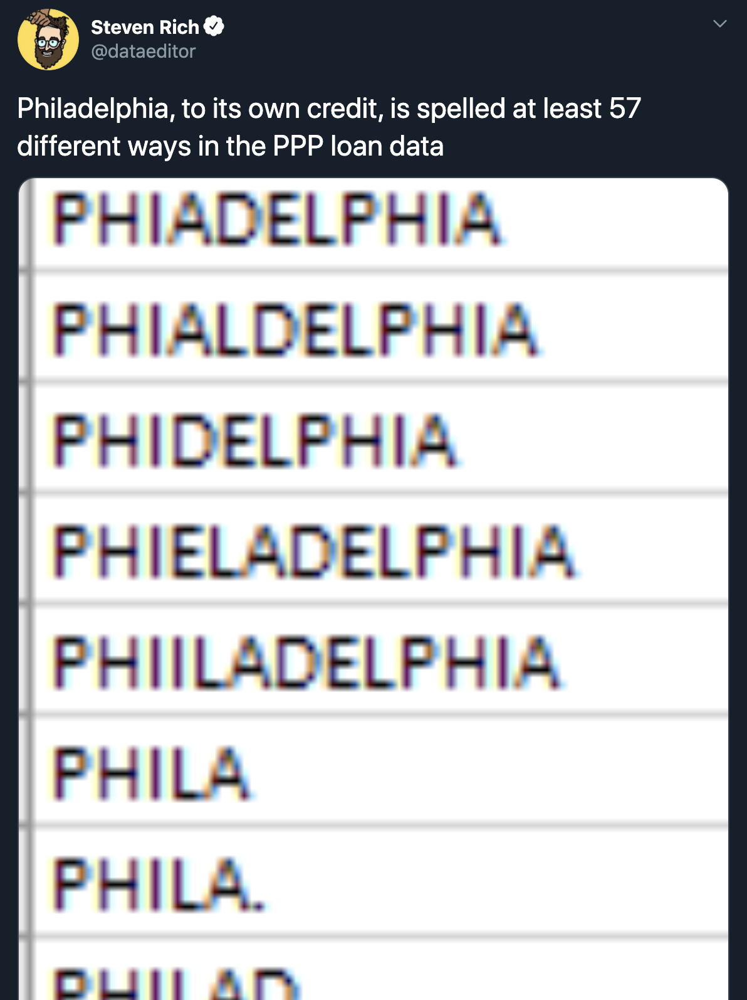
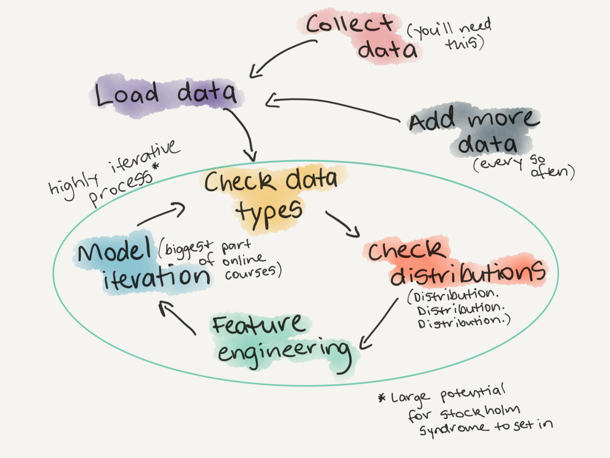

## Concepts in Machine Learning Class 4: Exploratory Data Analysis, Experimental Design, and Ethics in Machine Learning

Welcome to class 4 of Concepts in Machine Learning!

Last class we covered unsupervised learning methods including k-means clustering and principle component analysis. Today we will cover some common steps to exploratory data analysis and why it's important. We'll also touch on ethics in machine learning.

By the end of this class you should be able to:

* Describe what exploratory data analysis is and why it's important.
* Understand the ethical implications of machine learning.

### What is exploratory data analysis?

The data that you're using in you're machine learning project is as important as the model you choose. 

Making meaning of highly dimensional data is complicated and error-prone. To have a solid start for a machine learning project, you need to analyze the data up front. This process is called exploratory data analysis (EDA). The goal of EDA is to describe the data through statistical analysis and visualization that highlights important features of the data for further analysis. It's important to gain a deep understanding of:
* The properties of the data (i.e. schema and statistical properties)
* The quality of the data (i.e. missing values and inconsistant data types)
* The predictive power of the data (i.e. correlations between features and the target)

### An EDA checklist

EDA is often unstructured and explorative of the data and as a result there are many different approaches to exploratory data analysis. Below are five prompts to get started with EDA on a new dataset.

1. What question(s) are you trying to solve (or prove wrong)?
2. What kind of data do you have and how do you treat different types?
3. What’s missing from the data and how do you deal with it?
4. Where are the outliers and why should you care about them?
5. How can you add, change or remove features to get more out of your data?

This is by no means a complete checklist of EDA items but is a good starting point.

### Let's practice!

Remember the OHSU dataset we looked at earlier in this course? Now, we will practice exploratory data analysis with this dataset.

| patient_Id    | age   | htn | treat | smoking | race     | t2d | gender | numAge | bmi | tchol| sbp | cvd |
| ------------- | ----- | --- | ----- | ------- | -------- | --- | ------ | ------ | --- | ---- | --- | --- |
| HHUID00076230 | 20-40 | Y   | Y     | N       | Asian/PI | N   | M      | 29     | 23  | 189  | 170 | N   |
| HHUID00547835 | 70-90 | N   | Y     | N       | White    | Y   | M      | 72     | 35  | 178  | 118 | N   |

#### 1. What question(s) are you trying to solve?

Start simple with one problem and work out from there to add complexity as needed.

Looking at this dataset I can tell that each row contains a single patient with demographic and health information and whether or not that patient has been diagnosed with cardiovascular disease.

Our problem: Can we predict if someone will get cardiovascular disease based on these attributes?

#### 2. What kind of data do you have?

This step is especially important in cases where you did not create your own dataset. You may be given, have found, or inherited datasets that you will use for analysis. A deep understanding of what each feature captures and how the data was collected is required to make a sound analysis.

**Interrogate how the data was collected and why.**
* Who collected this data? Are they a reputable source?
* Why was this data collected? Are there any restrictions to how it can be used or shared?
* How was this data collected? Does it make sense for me to use it for my research? Was it collected ethically?

[This](https://www.biorxiv.org/content/10.1101/232611v2) preprint paper discusses the "who", "how", and "why" of this dataset.
* OHSU created this dataset to assist in teaching classes on translational data science.
* This is a [synthetic dataset](https://en.wikipedia.org/wiki/Synthetic_data) meaning that it was created to mimic and capture the statistical properties of a real cardiovascular disease dataset but none of the rows represent real patients. Using synthetic data is beneficial in a teaching or practice setting because it does not contain any protected patient health information.

**Understand what information each feature captures.**
* If you're lucky your dataset will come with a data dictionary which will include a description of each column. Most of the times though, you have to do a little research. This can look like emailing back and forth with the person who collected the data, consulting an expert in the field, or a google search.

For this dataset I had to google a few of the column headers to understand what they meant. Here are some examples of my google searches that turned up the results I was looking for:
* `htn`
* `t2d`
* `sbp heart`
 * initially searched `sbp` but google gave me information about the Seattle Bouldering Project which I knew couldn't be correct.

**Investigate the data types in the data set.**
* Go colummn by column and make sure you understand the kinds of values each feature contains.
* Remove unnecessary columns if needed.

Based on the two-row subset of the data above we have the following data types:
* `patient_Id`: ID
* `age`: categorical
* `htn`: categorical, binary
* `treat`: categorical, binary
* `smoking`: categorical, binary
* `race`: categorical
* `t2d`: categorical, binary
* `gender`: categorical
* `numAge`: numeric
* `bmi`: numeric
* `tchol`: numeric
* `sbp`: numeric
* `cvd`: categorical, binary

The above data types are based off of only two rows of the data. It's good practice to confirm each data type by investigating the entire column. Sometimes a variable might appear to be categorical but typos and misspellings mean than cleaning is required.

An example of this:

  

You might assume that a variable that designates the state in which a business is located in the Paycheck Protection Program dataset would have only 50 categories (one for each state). However this is not the case, as this data scientist found out. Datasets are often created by humans manually entering in information. Without clear guidelines on what kind of input is accepted there will usually be quite a bit of variance in the data from human error.

### 3. What's missing from your data?

After determining what is in your dataset, it's time to investigate what is missing! It's crucial to identify features where data is missing as you cannot make accurate predictions using data that is incomplete.

`NA` is often used to denote missing data, but sometimes you might find missing data as blank cells, `NAN`, or `-`. An analyst might visualize missing data like the plot below.

**Show visual check of missing data**

There are a few things you can do with missing data:
* Remove the column
 * Machine learning algorithms work best with as much data as possible so this might not be ideal for smaller datasets.
* Impute values
 * This means to fill in the missing value with a value calculated from some other data.
 * You can fill in missing values with a calculated average or try and assign a value based on similar patients in the dataset.

Whatever you choose to do with missing data it's important to clearly note what was done and why and take it into account in downstream analysis.

### 4. Outliers

Depending on your model, outliers can have a drastic effect on the results. Specifically we mentioned in last class that ordinary least squares regressions are very sensative to outliers. The definition of an outlier varies by dataset. A general rule you could go by is that if a data point is anything more than three standard deviations away from the mean it is an outlier. When in doubt, it's best if you can consult a subject matter expert.

The easiest way to find outliers is to look at the distributions of each feature in your data.

Outliers are very important to creating a statistical model. Keeping drastic outliers can lead to your model being overfit to the training dataset. Removing all outliars can lead to a model being overly generalized and it won't handle any data points that are out of the ordinary.
 
### 5. Getting more out of the data with feature engineering

Feature engineering is the process of using domain knowledge to extract features from raw data. More features mean more data for your model to use to make predictions which is generally considered a good thing in machine learning. What features you create will be highly dependent on the dataset and goals of the analysis so this process takes a bit of experimentation and creativity. The cardiovascualar disease risk dataset that we are using is fairly limited since it consists of only 1 table with 13 features. In reality machine learning models use multiple tables with hundreds of features that you could use to generate new data.

The simplest form of feature engineering is combining categorical features. This new, combined categorical feature can give information about interactions between categorical variables.

### Exploratory data analysis is a step in the cyclical nature of model building

  

### Ethics in machine learning
* Define ethics
* Introduce the idea that research and tech are not 'neutral' or 'unbiased'

### Replicating biases
* More focus on creating ethical algorithms these days, but there also needs to be focus on identifying biases in data, features, and inferences that we make
* ML algorithms learn from datasets but what happens when biases are baked into the dataset?
* Having a deep understanding of how biases play out in the real world can help ID this
  * ex: understanding that when using policing data for prediction it may say more about the nature of policing than the people who are criminalized by the system.
  
### What happens when the machine guesses wrong?
* Machines are not perfect - error is unavoidable
* Need to deeply consider the impact of when the machine is wrong
* We are using ML to determine who gets loans, government assistance, and even the length of criminal sentenceing the consequences of the machine being wrong are HUGE
* Human review of machine decisions is vital

### Machine learning applications are not naturally transparent
* ML can be used like a black box
* If we don't know how the machine is making decisions how can we know it's not making biased or wrong decisions?
* Reproducibility is difficult
* Thourough documentation is vital

### Data security
* ML applications require TONS of data.
* Often times this data may contain personal information
* Even when using metadata or data that may seem innocuous we need to carefully consider how this data could reveal sensitive info 
* Ex: cambridge analytica scandle

### Wrapping up

### Extra materials

If you have some coding experience and want to practice setting up your first model:
* [Practice setting up your first machine learning model in Python with Kaggle](https://www.kaggle.com/learn/intro-to-machine-learning)
* [Practice setting up a machine learning model in R with TidyModels](https://www.tidymodels.org/start/models/)

https://medium.com/@CoalitionForCriticalTechnology/abolish-the-techtoprisonpipeline-9b5b14366b16
https://www.nature.com/articles/d41586-020-00160-y

### Closing

Upcoming R and Python machine learning courses
